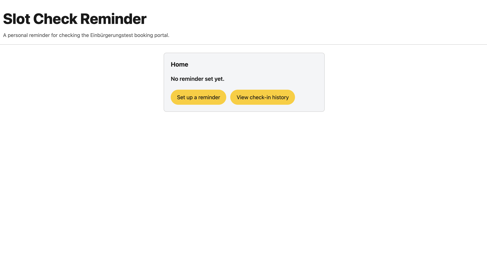
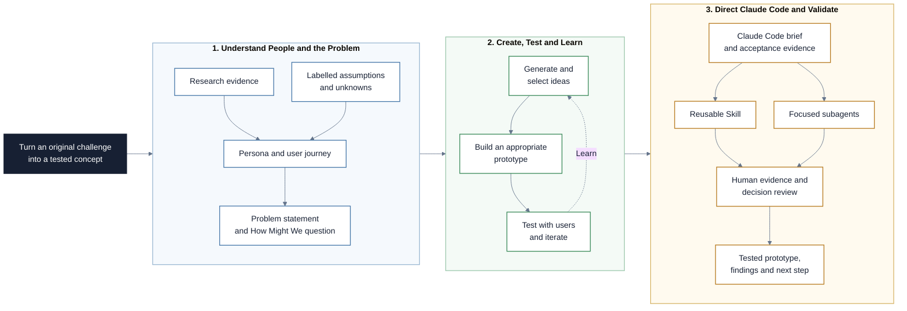

# Design Thinking

This repository is a Markdown-based learning path for using Design Thinking as
a practical product discovery and problem-solving approach. Participants move
from understanding design processes to evidence-based empathy, problem framing,
ideation, prototyping, testing, and iteration. They then configure Claude Code
with a reusable Skill and focused subagents so the agent can produce most of the
artifacts while the AI Project Manager owns evidence and decisions.

## Live Prototype

Try it here: https://evelynmoralesmartinez-cmd.github.io/aipm-design-thinking/prototype/

## Project at a Glance

The project follows one evidence-driven learning cycle from an original user
challenge to a tested concept, with Claude Code producing artifacts under PM
direction.

## Learning Objectives

By the end of this repository, you should be able to:

- Explain why product teams use structured design processes.
- Distinguish Design Thinking, the Double Diamond, and a timeboxed design sprint.
- Investigate user needs through observations, interviews, existing evidence, and
  clearly labelled assumptions.
- Create an evidence-backed persona and a focused user journey map.
- Turn research insights into a problem statement, point of view, and How Might
  We question.
- Generate and select ideas without jumping too quickly to a feature.
- Build a prototype whose fidelity matches the learning question.
- Plan and run a lightweight usability test, then use evidence to iterate.
- Connect a journey map to user stories and a small story map.
- Explain the difference between a Claude Code Skill and a subagent.
- Create a project Skill that turns the Design Thinking method into a reusable
  workflow.
- Use focused subagents to audit evidence and review a prototype without
  presenting simulated opinions as user research.
- Evaluate and improve a Skill or subagent after observing how it influences
  Claude Code's work.
- Delegate artifact creation and prototype iteration while keeping evidence and
  human decisions in control.

## Learning Path

The modules build on each other in order.

| File / Folder | Description |
|---|---|
| [**01 - Design Processes and Design Thinking**](01-design-processes-and-design-thinking.md) | Understand the purpose of design processes and compare Design Thinking with the Double Diamond and design sprints. |
| [**02 - Empathise with Evidence**](02-empathise-with-evidence.md) | Gather evidence about users and turn it into a persona and journey map without confusing assumptions with facts. |
| [**03 - Define and Ideate**](03-define-and-ideate.md) | Synthesize research into a focused problem frame, then generate and select possible responses. |
| [**04 - Prototype, Test, and Iterate**](04-prototype-test-and-iterate.md) | Choose prototype fidelity, run a useful test, and make the next learning cycle explicit. |
| [**05 - Claude Code Skills and Subagents**](05-claude-code-skills-and-subagents.md) | Turn the Design Thinking method into a reusable Skill and delegate focused review work to isolated subagents. |
| [**06 - Session Handout**](06-session-handout.md) | Choose an original challenge, direct Claude Code through a complete Design Thinking cycle, and use optional extensions for deeper agent and product work. |

### Additional Folders and Files

| File / Folder | Description |
|---|---|
| [**assets**](assets/) | Local process diagrams, Design Thinking references, and attributed excerpts from the official Anthropic documentation. |

## Getting Started

No Python environment is required for this repository.

1. Open Claude Code using any available interface, such as the VS Code
   extension, CLI, desktop application, or another graphical interface, and
   make the project files available to it.
2. Open `README.md`.
3. Read the lesson files in numerical order.
4. Use the session handout for the practical workshop.
5. Use Claude Code through your chosen interface when the handout introduces
   the agent workflow.
6. Keep a clear separation between direct evidence, interpretation, and open
   questions in every deliverable.

## AI Collaboration Guidelines

Claude Code can structure notes, challenge a problem statement, produce
artifacts, build a prototype, and implement an approved iteration. AI output is
not user evidence. Do not enter sensitive personal data into an AI tool.
Remove names and identifying details from research notes before sharing them
with Claude Code. Keep a short collaboration log containing the request, what
Claude produced, what was verified, and what the team accepted, edited, or
rejected.

## References & Further Reading

- [Course source deck: 89 - Design Processes & Design Thinking](https://docs.google.com/presentation/d/1_OhG17l4RHx3cS6kGLVqc1FrTLK9nQqF0hUgzhb7NyY) (course workspace access may be required): source presentation covering design processes, Design Thinking, and the five stages used in this repository.
- [Design Council: The Double Diamond](https://www.designcouncil.org.uk/resources/the-double-diamond/): official explanation of Discover, Define, Develop, and Deliver, including the role of divergent and convergent thinking. The visual is licensed under CC BY 4.0.
- [Stanford d.school: Design Thinking Bootleg](https://dschool.stanford.edu/tools/design-thinking-bootleg): practical methods organised around Empathize, Define, Ideate, Prototype, and Test. The resource is licensed under CC BY-NC-SA 4.0.
- [GOV.UK Service Manual: Researching user experiences](https://www.gov.uk/service-manual/user-research/researching-user-experiences): an experience-map structure for documenting what people do, think, and feel.
- [Wikimedia Commons: Journey Map WD Cultural Institutions base version](https://commons.wikimedia.org/wiki/File:Journey_Map_WD_Cultural_Institutions_base_version.svg): an example of a detailed journey-map canvas, licensed under CC BY 4.0.
- [Nielsen Norman Group: Journey Mapping 101](https://www.nngroup.com/articles/journey-mapping-101/): overview of journey maps, their purpose, and the information they can contain.
- [GOV.UK Service Manual: User research](https://www.gov.uk/service-manual/user-research): practical guidance for planning and conducting user research in service development.
- [Claude Code: Extend Claude with Skills](https://code.claude.com/docs/en/skills): official guide to project Skills, `SKILL.md`, invocation, and scope.
- [Claude Code: Create custom subagents](https://code.claude.com/docs/en/sub-agents): official guide to isolated project subagents, tools, permissions, and delegation.
- [Claude Code: Extend Claude Code](https://code.claude.com/docs/en/features-overview): official comparison of Skills, subagents, and other extension mechanisms.
- [Claude Code: Set up Claude Code](https://code.claude.com/docs/en/setup): official installation, authentication, and update instructions.
